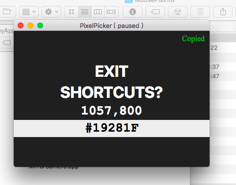
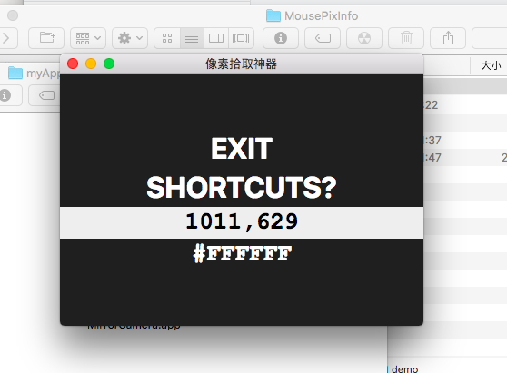
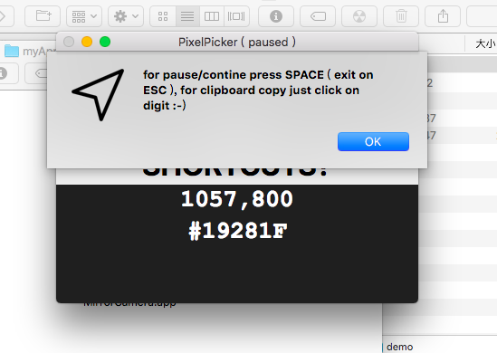

# MousePixInfo
display the pixel Info of the mouse location including the ordination &amp; the RGB

## 两种方式实现,分别是javaSE swing(deprecated)实现的桌面应用, 还有一个是nodejs electron模块实现的环境无关软件

----

> 注意, javaSE版本已停止维护, 最终版本1.1.3, 2018-3-3
> 
> electron最新版本 2.3.8